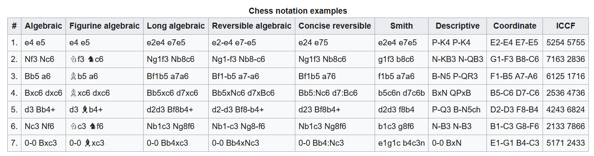

# baba-chess (Rev.1.1)
Omar Salih, Arturo Joya, Drew Pang

This repository contains the necessary files needed to run a game of Chess in Python.

## Python Dependencies
This chess board implementation was written in a Conda environment using Python 3.9.7.

### Code Testing
Although the following is not essential for gameplay, it is helpful to have Pytest installed. If you are unsure whether you have pytest installed, you can do so by running the following command `pip install -U pytest`

## Use the Code
To begin using this code, clone this repository onto a directory of your choice. You will want to make sure that you have `chess_board_alternative`, `chess_view`, `chess_controller`, and `chess_game`.
- Open a new terminal, make sure that you are in the same directory as the code.
- Run `python chess_game.py main` on the terminal.
- That's all! you should see the following prompt on the screen: {TODO: UPDATE IMAGE}

## Test the Code
Testing the code is not necessary for game play, but to make sure that the code is working properly before running the game, it will be helpful to run these tests.

Firstly, ensure that you are in the directory where the clone of this repository lives. Then run `pytest`. If all goes well you should see the following screen
 {INSERT IMAGE OF ALL UNIT TESTS PASSING}.

## Play the Game
The board is set up such that the uppercase letters represent the white player, and the lower case letters represent the black player. The current revision now takes in LAN (long algebraic notation). Note that we are using a simplified version of LAN, such that only the "spots" are noted. For example, to make the move e4 in standard algebraic notation, it would be `e2-e4` in our implementation. For the move Nf6 in standard algebraic notation, that move would be made with the input `g8-f6` which moves the piece at g8 (in this case the black knight) to the spot f6. Please refer to the table below for Chess notation translations.

*Note*, castling and pawn promotions have not been implemented yet, therefore those commands should not be attempted as they will result in an invalid-move-prompt.

While playing the game of chess, it is possible that an incorrect move is played. At the mercy of the next player, the input `undo` can be called to revert the state of the board to one move prior. Note that calling `undo` twice will undo the undo and revert the board back to how it was before the undo.

This board implementation does not yet contain a check or checkmate checker; however, to quit the match, you may input `quit` to quit the match. Note that this match does not get saved, and thus the next time that the game is launched, it will be a brand new game.

## Future Implementations
Rev.1.1 seeks to implement the following features:
- Promote Pawn
- Castle
Coming soon...