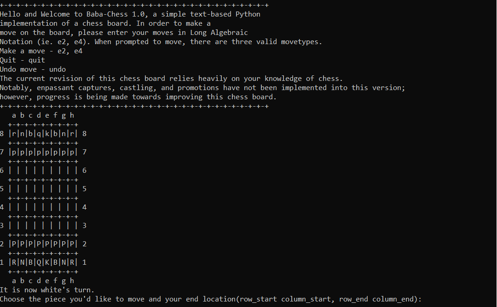

# baba-chess (Rev.1.0)
Omar Salih, Arturo Joya, Drew Pang

This repository contains the necessary files needed to run a game of Chess in Python.

## Python Dependencies
This chess board implementation was wr

## Use the Code
Feel free to in a Conda environment using Python 3.9.7.

To begin using this code, copy this repository onto a directory of your choice. You will want to make sure that you have `chess_board_alternative`, `chess_view`, `chess_controller`, and `chess_game`.
- Open a new terminal, make sure that you are in the same directory as the code.
- Run `python chess_game.py main` on the terminal.
- That's all! you should see the following prompt on the screen:

## Play the Game
The board is set up such that the uppercase letters represent the white player, and the lower case letters represent the black player. The current revision does not accept LAN (long algebraic notation); however, it does accept LAN style move inputs. In order to make a move, the player must input the starting  coordinates of the piece, separated by a comma and a space, followed by the coordinates of the ending position for said piece. Notably, the origin of this coordinate system begins at a8, therfore a8 is represented by 0 0. To move a pawn from e2 to e4, the input would be `6 4,4 4`. This will be temporary until LAN gets implemented to this game of chess.

*Note*, this text-based chess board implementation has roughly the same functionality, and relies on the player's knowledge of chess to make valid moves. In the case of an invalid move called out by the opponent, you can input `undo` to revert the move - note you can only move back one turn.

*Also note* that this board implementation does not contain a check or checkmate checker; however, to quit the match, you may input `quit` to quit the match. Note that this match does not get saved, and thus the next time that the game is launched, it will be a brand new game.

## Future Implementations
Rev.1.1 seeks to implement the following features:
- Long Algebraic Notation inputs (e2 e4)
- Legal-Move-Checker
Coming soon...